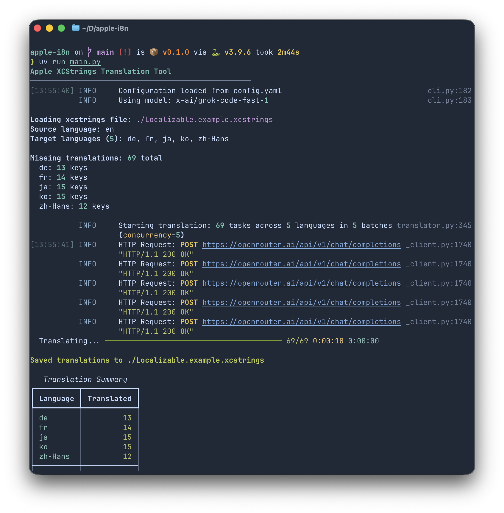

# Apple i18n — 用 AI 帮你搞定多语言翻译

做 Apple 开发的都知道，多语言适配是个体力活。不管你是做 iOS、macOS、iPadOS、watchOS、tvOS 还是 visionOS，只要项目里有 `Localizable.xcstrings` 文件，翻译工作就跑不掉。

这个工具就是来帮你干这个的 —— 把 `.xcstrings` 里的基准语言(可以自行设置, 例如zh-Hans, en等等,前提是.xcstrings中已经有的语言)，通过 LLM 自动翻译成其他所有语言，然后直接写回文件。你只管提交代码就好。

## 截图



## 它能做什么

- 自动读取你的 `.xcstrings` 文件，分析里面有哪些语言、哪些条目还缺翻译
- 调用大语言模型（OpenAI 接口格式，兼容各种第三方 API）把缺的翻译补上
- 翻译结果直接合并回原文件，格式不会乱
- 纯符号、格式占位符（`%@`、`%lld` 之类的）会自动跳过，不瞎翻
- 已经翻译好的条目不会重复翻，跑多少次都安全
- 支持批量请求 + 并发调用，翻译速度很快
- 有进度条和翻译摘要，看着舒服

## 怎么用

### 1. 安装 uv

如果你还没装 [uv](https://docs.astral.sh/uv/)（一个超快的 Python 包管理器），可以查看官方文档如何安装: `https://docs.astral.sh/uv/`, 先装一下：

Macos brew包管理器安装
```bash
brew install uv
```

### 2. 克隆项目 & 安装依赖

```bash
git clone https://github.com/byteoxo/apple-i18n.git
cd apple-i8n
uv sync
```

`uv sync` 会自动创建虚拟环境并安装所有依赖，不用你操心。

### 3. 配置

把示例配置复制一份：

```bash
cp config-example.yaml config.yaml
```

然后编辑 `config.yaml`：

```yaml
llm:
  base_url: "https://api.openai.com/v1"   # API 地址，兼容 OpenAI 格式的都行
  api_key: "sk-你的密钥"                    # API 密钥
  model: "gpt-4o-mini"                     # 模型名称

translation:
  source_language: "en"                    # 基准语言，从这个语言翻译到其他语言
  xcstrings_path: "./Localizable.xcstrings" # 你的 xcstrings 文件路径
  batch_size: 20                           # 每次请求翻译多少条
  max_concurrency: 5                       # 最多同时发几个请求
```

**关于基准语言：** `source_language` 就是你的"源头"。设成 `en` 就是从英文翻译到其他语言，设成 `zh-Hans` 就是从简体中文翻译到其他语言。你设什么，工具就信什么，前提是文件里确实有这个语言的内容。

### 4. 把你的 xcstrings 文件放进来

把 Xcode 项目里的 `Localizable.xcstrings` 复制到这个目录下（或者在配置`config.yaml`里指定路径）。

### 5. 跑起来

```bash
uv run main.py
```

跑完之后你会看到一个翻译摘要表格，告诉你每种语言翻译了多少条。翻译结果已经直接写回你的 `.xcstrings` 文件了，拷贝回 Xcode 项目即可。

## 项目结构

```
apple-i8n/
├── main.py                 # 入口
├── config.yaml             # 你的配置（不应当被提交到 git）
├── config-example.yaml     # 配置示例, 
├── Localizable.xcstrings   # 你的多语言文件
├── pyproject.toml          # 项目依赖
└── apple_i8n/
    ├── config.py           # 配置加载
    ├── xcstrings.py        # xcstrings 文件解析和写入
    ├── translator.py       # LLM 翻译引擎
    └── cli.py              # 命令行界面、进度条、日志
```
